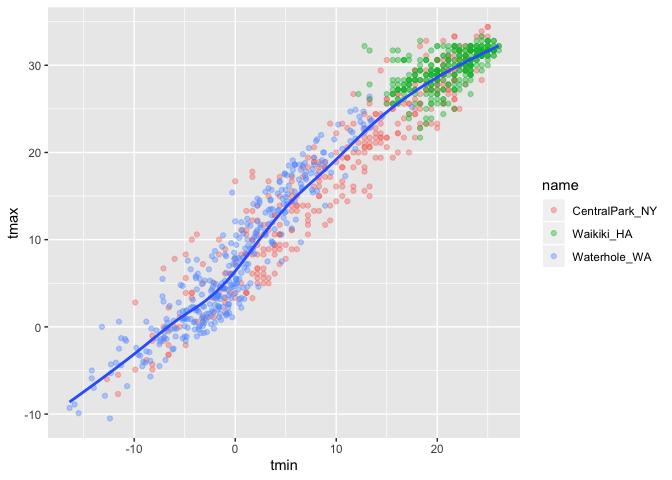
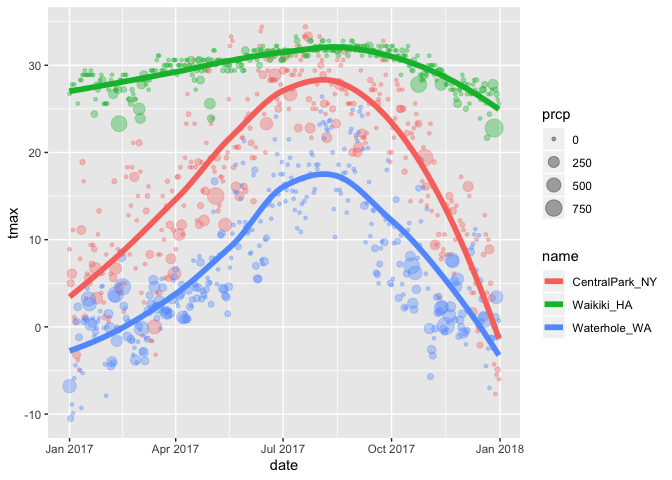
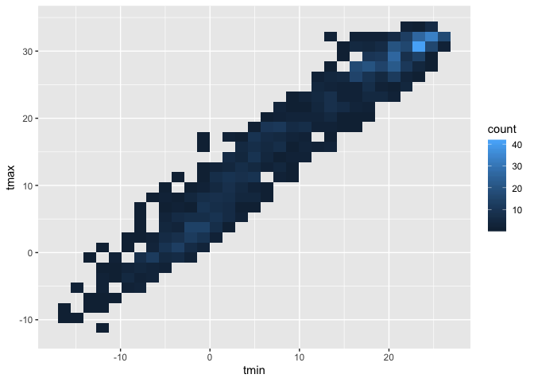
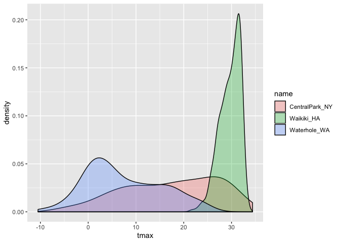
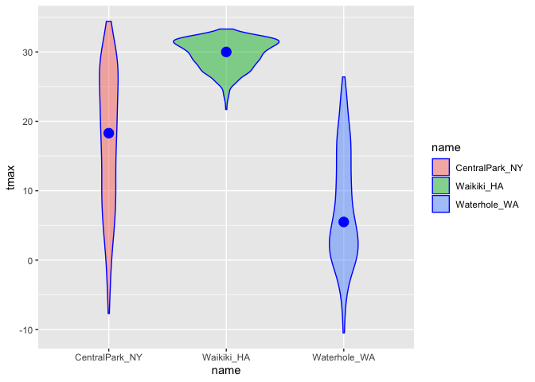
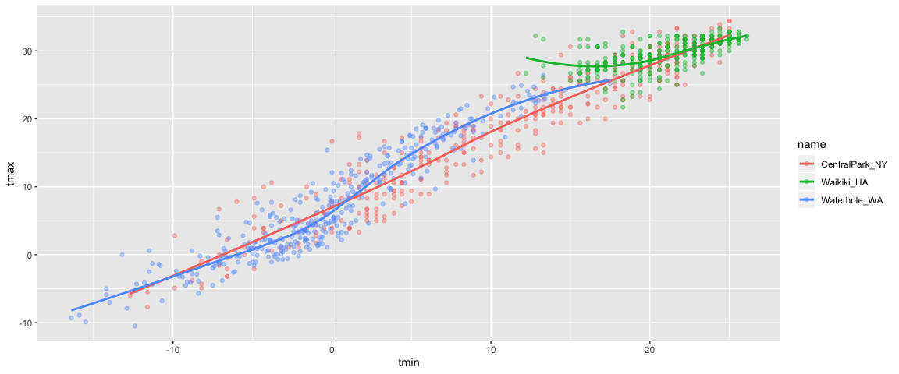

ggplot\` 1
================

## copy

``` r
weather_df = 
  rnoaa::meteo_pull_monitors(c("USW00094728", "USC00519397", "USS0023B17S"),
                      var = c("PRCP", "TMIN", "TMAX"), 
                      date_min = "2017-01-01",
                      date_max = "2017-12-31") %>%
  mutate(
    name = recode(id, USW00094728 = "CentralPark_NY", 
                      USC00519397 = "Waikiki_HA",
                      USS0023B17S = "Waterhole_WA"),
    tmin = tmin / 10,
    tmax = tmax / 10) %>%
  select(name, id, everything())
```

    ## Registered S3 method overwritten by 'crul':
    ##   method                 from
    ##   as.character.form_file httr

    ## Registered S3 method overwritten by 'hoardr':
    ##   method           from
    ##   print.cache_info httr

    ## file path:          /Users/向楚玥/Library/Caches/rnoaa/ghcnd/USW00094728.dly

    ## file last updated:  2019-09-26 10:25:19

    ## file min/max dates: 1869-01-01 / 2019-09-30

    ## file path:          /Users/向楚玥/Library/Caches/rnoaa/ghcnd/USC00519397.dly

    ## file last updated:  2019-09-26 10:25:31

    ## file min/max dates: 1965-01-01 / 2019-09-30

    ## file path:          /Users/向楚玥/Library/Caches/rnoaa/ghcnd/USS0023B17S.dly

    ## file last updated:  2019-09-26 10:25:35

    ## file min/max dates: 1999-09-01 / 2019-09-30

## create a ggplot

``` r
ggplot(weather_df, aes(x = tmin, y = tmax)) +
  geom_point()
```

    ## Warning: Removed 15 rows containing missing values (geom_point).

<!-- --> alternative
way of making this plot

``` r
weather_df %>%
  ggplot(aes( x= tmin, y = tmax)) +
  geom_point()
```

    ## Warning: Removed 15 rows containing missing values (geom_point).

<!-- --> saving initial
plots

``` r
scatterplot = 
  weather_df %>%
  ggplot(aes( x= tmin, y = tmax)) +
  geom_point()

scatterplot
```

    ## Warning: Removed 15 rows containing missing values (geom_point).

<!-- -->

adding color…

``` r
weather_df %>%
  ggplot(aes( x= tmin, y = tmax)) +
  geom_point(aes(color = name), alpha = .4)
```

    ## Warning: Removed 15 rows containing missing values (geom_point).

<!-- -->

why do `aes` positions matter?

``` r
weather_df %>%
  ggplot(aes( x= tmin, y = tmax)) +
  geom_point(aes(color = name), alpha = .4) +
  geom_smooth(se = FALSE)
```

    ## `geom_smooth()` using method = 'gam' and formula 'y ~ s(x, bs = "cs")'

    ## Warning: Removed 15 rows containing non-finite values (stat_smooth).

    ## Warning: Removed 15 rows containing missing values (geom_point).

<!-- -->

vs

``` r
weather_df %>%
  ggplot(aes( x= tmin, y = tmax, color = name)) +
  geom_point(aes(color = name), alpha = .4)
```

    ## Warning: Removed 15 rows containing missing values (geom_point).

<!-- -->

``` r
  geom_smooth(se = FALSE)
```

    ## geom_smooth: na.rm = FALSE, se = FALSE
    ## stat_smooth: na.rm = FALSE, se = FALSE, method = auto, formula = y ~ x
    ## position_identity

facet\!

``` r
weather_df %>%
  ggplot(aes( x= tmin, y = tmax, color = name)) +
  geom_point(aes(color = name), alpha = .4) +
  geom_smooth(se = FALSE) +
  facet_grid(~name)
```

    ## `geom_smooth()` using method = 'loess' and formula 'y ~ x'

    ## Warning: Removed 15 rows containing non-finite values (stat_smooth).

    ## Warning: Removed 15 rows containing missing values (geom_point).

<!-- -->

this is fine, but not interesting hahahaha

``` r
weather_df %>%
  ggplot(aes( x = date, y = tmax, color = name)) +
  geom_point(aes(size = prcp), alpha = 0.35) +
  geom_smooth(size = 2, se = FALSE)
```

    ## `geom_smooth()` using method = 'loess' and formula 'y ~ x'

    ## Warning: Removed 3 rows containing non-finite values (stat_smooth).

    ## Warning: Removed 3 rows containing missing values (geom_point).

<!-- -->

## Some extra stuff

``` r
weather_df %>%
  ggplot(aes( x = date, y = tmax, color = name)) +
  geom_smooth(size = 2, se = FALSE)
```

    ## `geom_smooth()` using method = 'loess' and formula 'y ~ x'

    ## Warning: Removed 3 rows containing non-finite values (stat_smooth).

<!-- --> 2d density

``` r
weather_df %>%
  ggplot(aes(x = tmin, y = tmax)) +
  geom_bin2d()
```

    ## Warning: Removed 15 rows containing non-finite values (stat_bin2d).

<!-- -->

## More kinds of plots\!\!\!

``` r
weather_df %>%
  ggplot(aes(x = tmax, fill = name)) +
  geom_histogram() +
  facet_grid(~name)
```

    ## `stat_bin()` using `bins = 30`. Pick better value with `binwidth`.

    ## Warning: Removed 3 rows containing non-finite values (stat_bin).

<!-- -->

density plot\!\!

``` r
weather_df %>%
  ggplot(aes(x = tmax, fill = name)) +
  geom_density(alpha = .3)
```

    ## Warning: Removed 3 rows containing non-finite values (stat_density).

<!-- -->

``` r
weather_df %>%
  ggplot(aes(x = name, y = tmax)) + 
  geom_boxplot()
```

    ## Warning: Removed 3 rows containing non-finite values (stat_boxplot).

<!-- -->

``` r
ggplot(weather_df, aes(x = name, y = tmax)) + 
  geom_violin(aes(fill = name), color = "blue", alpha = .5) + 
  stat_summary(fun.y = median, geom = "point", color = "blue", size = 4)
```

    ## Warning: Removed 3 rows containing non-finite values (stat_ydensity).

    ## Warning: Removed 3 rows containing non-finite values (stat_summary).

<!-- -->

ridge plots\!\!\!

``` r
weather_df %>%
  ggplot(aes( x= tmax, y = name))+
  geom_density_ridges(scale = 0.85)
```

    ## Picking joint bandwidth of 1.84

    ## Warning: Removed 3 rows containing non-finite values (stat_density_ridges).

<!-- -->

## saving a plot

``` r
weather_plot = ggplot(weather_df, aes(x = tmin, y = tmax)) + 
  geom_point(aes(color = name), alpha = .5) 

ggsave("weather_plot.pdf", weather_plot, width = 8, height = 5)
```

    ## Warning: Removed 15 rows containing missing values (geom_point).

``` r
weather_df %>%
  ggplot(aes( x= tmin, y = tmax, color = name)) +
  geom_point(aes(color = name), alpha = .4) +
  geom_smooth(se = FALSE)
```

    ## `geom_smooth()` using method = 'loess' and formula 'y ~ x'

    ## Warning: Removed 15 rows containing non-finite values (stat_smooth).

    ## Warning: Removed 15 rows containing missing values (geom_point).

<!-- -->
